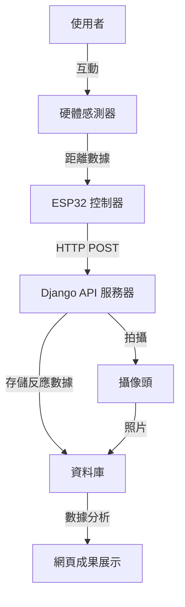
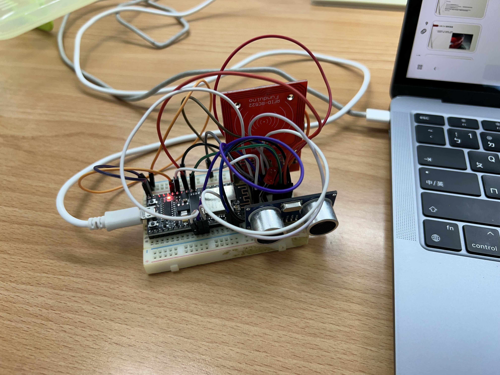
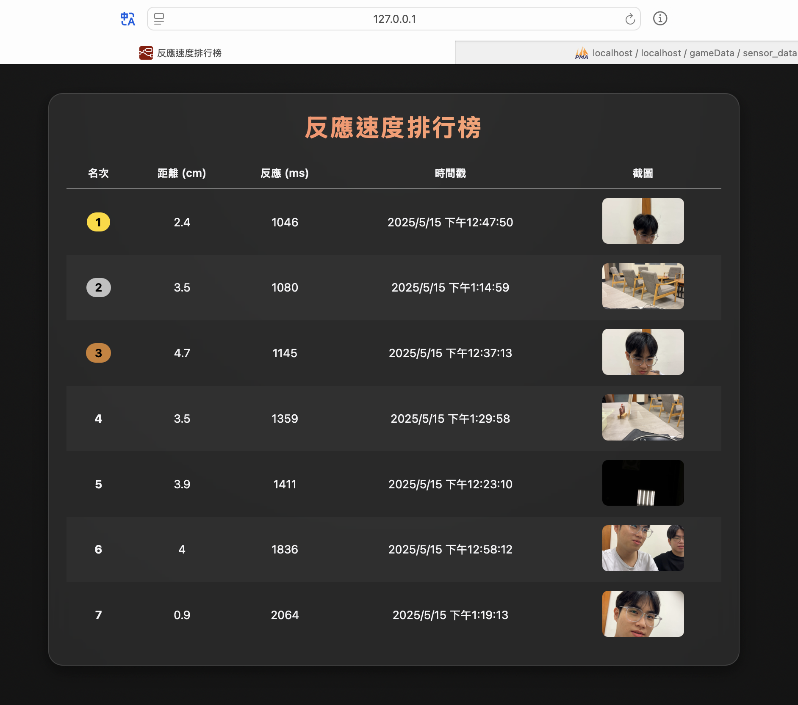

# 反應時間測試遊戲系統

**姓名：王冠傑 學號：D1149768**

## 1. 動機與目的

### 動機

基於論文的研究報告，以及觀察到在現代社會中，發現反應速度對於許多場景都至關重要，從運動競技到日常駕駛。
因此想要自己實作類似概念的產品。

且本專題的宗旨為：

- 建立一個可量化的反應時間測試系統
- 提供即時的視覺回饋和數據記錄
- 透過遊戲化方式提高使用者參與度

### 目的與辦法

由使用者用磁扣逼rfid作為遊戲的開始，開始後led燈會先提示使用者開始倒數，並且選擇2~4秒的隨機倒數時間。倒數完之後led會亮，表示開始測反應時間。當物體接近距離感測小於一定距離才會增測到，並且把傳資料上去資料庫，同時間用手機拍一張使用者的大頭照作為參賽者的紀錄，除此之外這樣也比較好辨認數據是誰的。最後用node-red去以排行榜去呈現排名以及使用者的大頭照。

## 2. 現有方法與缺點

### 傳統測試方法：

- 簡單的按鈕測試
- 基礎電腦程式

### 現有方法的缺點：

- 缺乏實時數據收集
- 無法提供視覺化回饋
- 數據分析能力有限
- 不有趣使用者參與度低
- 測試場景單一

## 3. 系統架構與情境圖

### 系統架構：

### 主要元件：

1. **硬體層**

   - ESP32 微控制器
   - 手機攝像頭系統
   - 超聲波距離感測器
   - led燈
   - rfid偵測器
2. **後端服務**

   - Django REST API
   - 資料庫系統 mysql
   - 影像處理模組 opencv
   - node-red 排行榜呈現

## 4. 成果展示

### 硬體實現

### 數據分析

### 系統特點：

1. **即時反應測試**

   - 精確的距離感測
   - 毫秒級響應時間記錄
   - 自動影像捕捉
2. **數據收集與分析**

   - 自動化數據存儲
   - 多維度數據分析
   - 視覺化結果呈現
3. **系統優勢**

   - 高精度測量
   - 自動化數據收集
   - 完整的數據記錄
   - 視覺化成果展示
   - 擴展性強

### 實際應用場景：

- 運動員反應能力訓練
- 駕駛員反應測試
- 遊戲玩家反應力評估
- 醫療康復訓練
- 教育研究使用
